<div align="center">
    
    <h1>
        MONITOR DE SITES
    </h1>
</div>

<p>Versão: 1.0</p>

<p>Este sistema realiza o monitoramento de sites, são enviadas requisições HTTP para a url do site cadastrado. A resposta é salva nos Logs dos endpoints. O envio da requisição é de acordo com a frequência que é cadastrada para o Endpoint do site, em minutos.
</p>
<br>

<h2>Instalação</h2>

<h3>1 - Configurar as variáveis de ambiente</h3>

```s
# Configurações da Aplicação
APP_NAME="Monitor de Sites"
APP_ENV=local #production
APP_DEBUG=true # false
APP_URL=your_url
APP_USER=app_user
APP_UID=1000

# Configurações de Banco de Dados
DB_CONNECTION=mysql
DB_HOST=db_host # nome do container db
DB_PORT=3306
DB_DATABASE=db_name
DB_USERNAME=db_user
DB_PASSWORD=db_password

# Configurações do servidor de e-mail
MAIL_MAILER=smtp
MAIL_HOST=your_provider_host
MAIL_PORT=your_port
MAIL_USERNAME=your_username
MAIL_PASSWORD=your_password
MAIL_ENCRYPTION=tls
MAIL_FROM_ADDRESS="your_email"
```

<h3>2 - Criar os containers da aplicação</h3>

```sh
docker-compose up -d --build
```

<h3>3 - Build do assets npm</h3>

```sh
npm run build
```
<br>
<h3>Pronto, a aplicação já deve estar disponível em <a href="http://localhost:8989">http://localhost:8989</a></h3>
<br>

<h2> Páginas do Sistema </h2>

<h4>Login</h4>
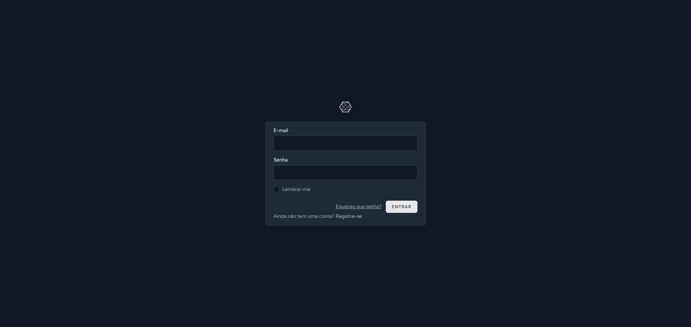

<h4>Recuperar Senha</h4>
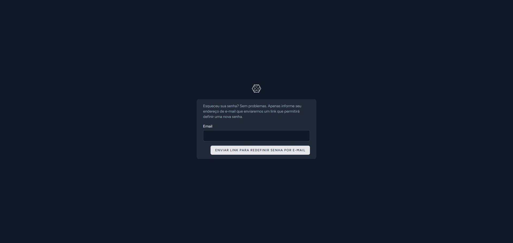

<h4>Cadastro</h4>
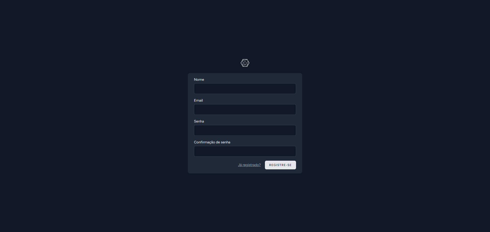

<h4>Painel de Controle</h4>
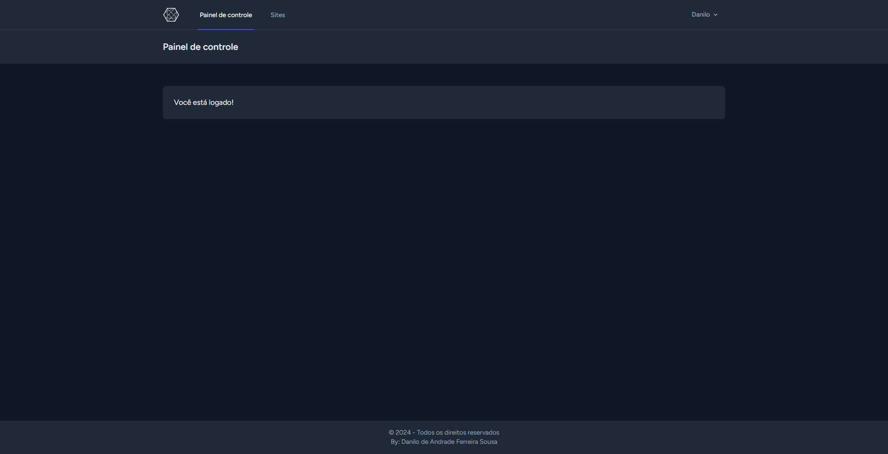

<h4>Sites</h4>
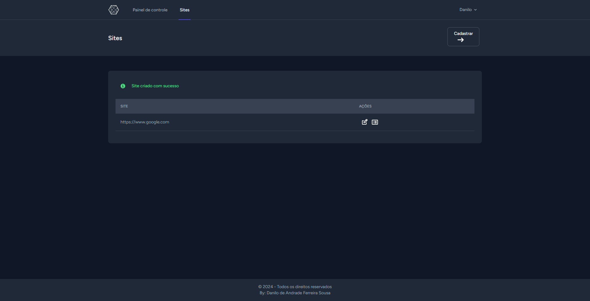

<h4>Cadastrar Site</h4>
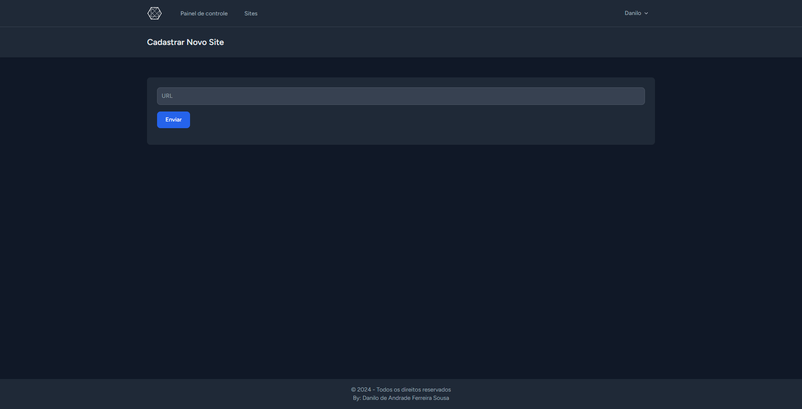

<h4>Editar Site</h4>
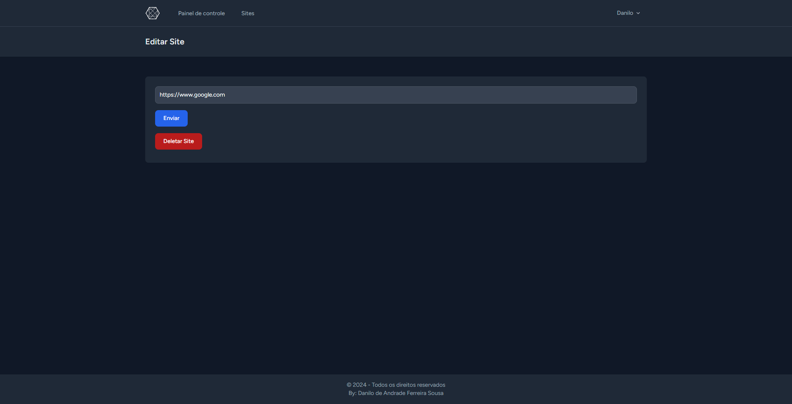

<h4>Endpoints</h4>
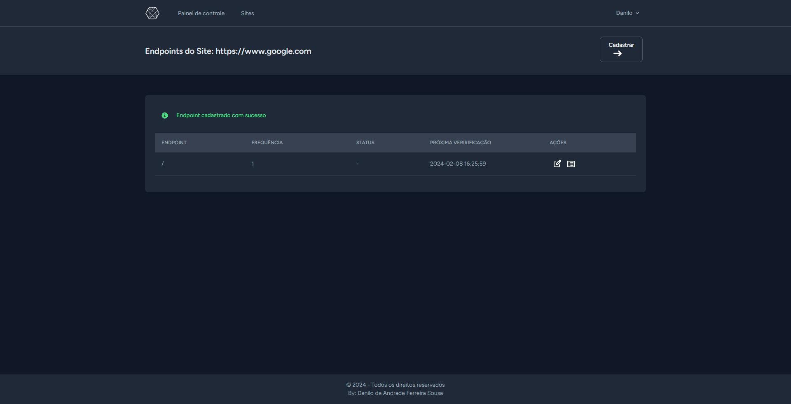

<h4>Cadastrar Endpoint</h4>
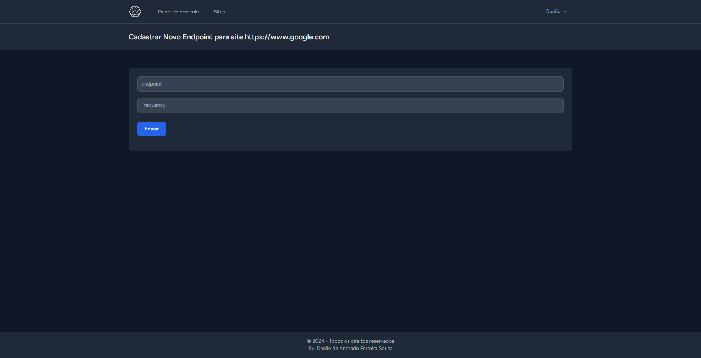

<h4>Editar Endpoint</h4>
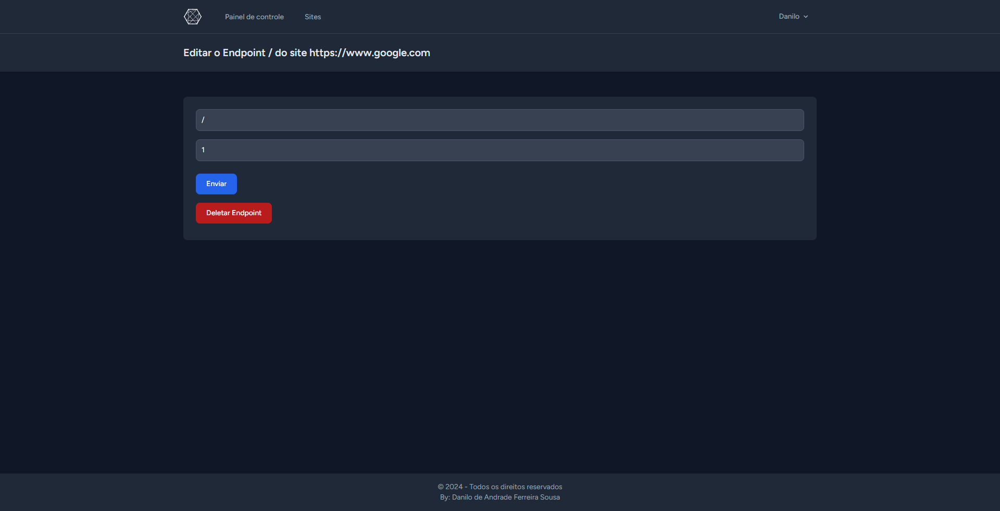

<h4>Endpoint Logs</h4>
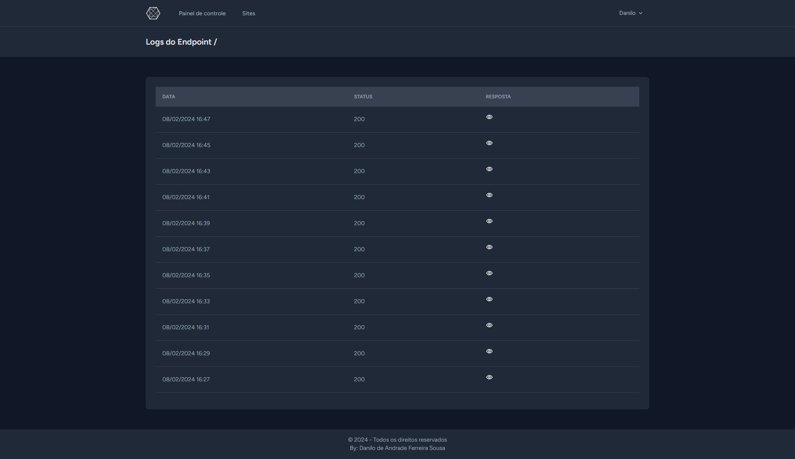

<h4>Perfil</h4>
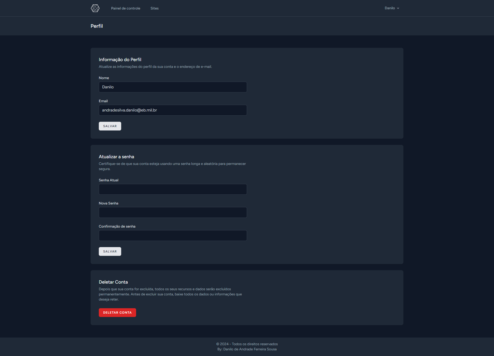

<h4>Deletar Conta</h4>
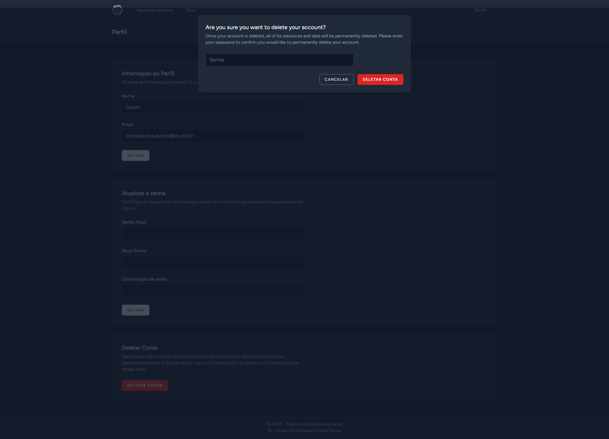
